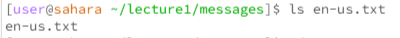
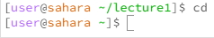
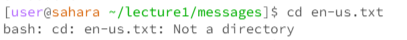
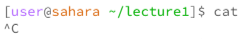
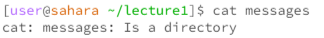

Lab Report 1.

Example 1: ls command with no arguments

Using the ls command with no arguments outside of the lecture1 directory simply lists that directory. There is no error

Example 2: ls command with path to directory as argument

Here we can see that when inside the lecture1 directory, in which the messages directory exists, we can use ls messages to get a list of all the files in the messages directory. There is no error

Example 3: ls command with path to file as argument

Here we can see that when in the lecture1/messages directory, using ls to access one of the files simply states the name of that file. This is because ls is essentially a list command, and simply lists the file. There is no error.

Example 4: cd commmand with no arguments

The cd command is the command to enter a directory, and therefore using it with no arguments will bring you back to the parent directory. In this screenshot, we are in the lecture1 directory, and as you can see, using cd with no arguments will lead us back to the parent directory. There is no error.

Example 5: cd commmand with path to directory as argument

In this screenshot, we are once again in the lecture1 directory, and using the command cd messages, we are able to access the messages directory. As we can see in the screenshot, after using cd messages, our directory changes to lecture1/messages. There is no error

Example 6: cd commmand with path to file as argument

Using cd to enter a file cannot be done. In this screenshot, we are in the lecture1/messages directory, and attempting to use cd on the english file of hello world. This cannot be done, and so we get an error. 

Example 7: cat commmand with no argument

Using the cat command with no argument starts a process that cannot be stopped without using ctrl+C. It attempts to read all the files it can find, but in the screenshot, we are in the lecture1 directory, so this isn't possible, and it continues infinitely. While this doesn't technically count as an error, it can be considered one.

Example 8: cat commmand with path to directory as argument

In this screenshot we are in the lecture1 directory. Using cat with a path to directory, messages, simply results in an error, as messages is not a file, and therefore it cannot read it, causing an error.

Example 9: cat commmand with path to file as argument

In this screenshot, we are in the lecture1/messages directory. Using cat on one of the files in this directory, en-us.txt will simply print the text written in this file, working perfectly. There is no error
