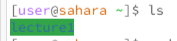
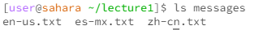

Lab Report 1.

Example 1: ls command with no arguments

Using the ls command with no arguments outside of the lecture1 directory simply lists that directory. There is no error

Example 2: ls command with path to directory as argument

Here we can see that when inside the lecture1 directory, in which the messages directory exists, we can use ls messages to get a list of all the files in the messages directory. There is no error

Example 3: ls command with path to file as argument

Here we can see that when in the lecture1/messages directory, using ls to access one of the files simply states the name of that file. This is because ls is essentially a list command, and simply lists the file. There is no error.

Example 4:

