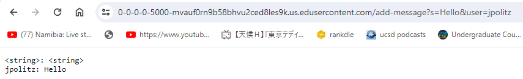

Lab Report 2.

Part 1 - ChatServer

Code for ChatServer.java

Two screenshots of using /add-message:

For both of these method, String handleRequest(URI url) is called, which then goes to the else if function as the path starts with /add-message. 

In the first screenshot, the argument 0, msg, is Hello, and for the second screenshot it is How are you (which appears as How+are+you)

In both of these examples, as we can see in the code, the initial values of user, msg, and message are empty strings, but for the input in the /add-message, we split it into two parts, where it finds out which part of the command is the string and which part is the user, and then updates the values for msg and user. Then, it changes the string message to be user + ": " + msg + "\n".

This is the format given, and the \n is for the purpose of ensuring each message is on a new line.

Part 2:

C:\Users\Admin/.ssh/id_rsa. is the absolute path to the private key for the SSH key for logging into ieng6.

C:\Users\Admin/.ssh/id_rsa.pub. is the absolute path to the public key for the SSH key for logging into ieng6.

Screenshot of logging into my ieng6 account without using password:

Part 3.

In lab 3, I learnt how to apply what I had learnt about creating web servers under a time constraint, and how to do it efficiently. For lab report 3, I learnt how to actually edit the code for the server itself, as I used the code from NumberServer as a basis and edited it to create ChatServer.  
