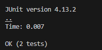
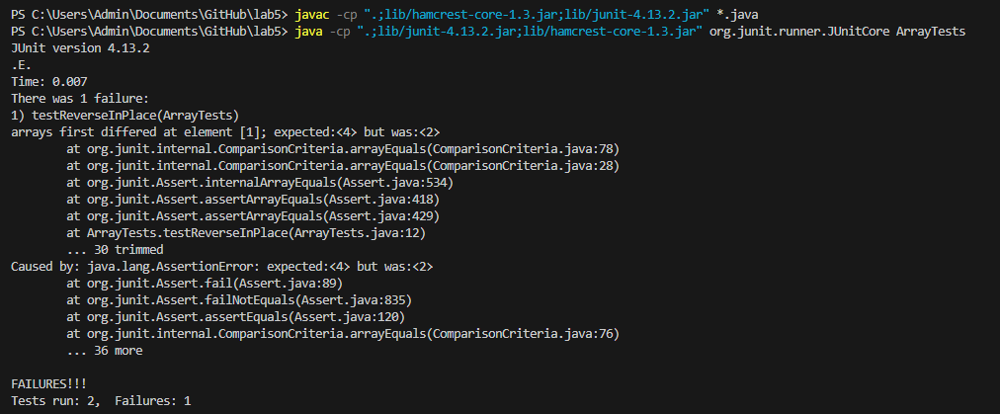

Week 5 - Lab Report 3.

Part 1 - Bugs.

The bug I chose from week 4's lab is the one that existed in the reverseInPlace method, in the ArrayExamples file.

First of all, here is the code for this method, as given, including the bug:

```
static void reverseInPlace(int[] arr) {
    for(int i = 0; i < arr.length; i += 1) {
      arr[i] = arr[arr.length - i - 1];
    }
```

Here is a failure inducing test:

```
int[] input2 = {4, 2};
ArrayExamples.reverseInPlace(input2);
assertArrayEquals(new int[]{ 2, 4 }, input2);
```

Here is a non-failure inducing test:

```
int[] input1 = { 3 };
ArrayExamples.reverseInPlace(input1);
assertArrayEquals(new int[]{ 3 }, input1);
```

Here are the outputs of running these two test:

Test 1 (pass):



Test 2 (fail):



Here is the changes made to the original method to fix the bug. The original method is written above:

```
static void reverseInPlace(int[] arr) {
    for(int i = 0; i < arr.length/2; i += 1) {
      int temp = arr[i];
      arr[i] = arr[arr.length - i - 1];
      arr[arr.length - 1 - i] = temp;
    }
}
```

The original method simply doesn't work, and instead replaces every element of the array with the value of it's last element, because the as the loop progresses, it overwrites the same values. The new one essentially uses a similar technique, but only iterates up to half the array, and swaps the elements from the beginning to the end.

Part 2 - Researching Commands.

I will be chosing the find command. The source I used is this:
<a href="https://man7.org/linux/man-pages/man1/find.1.html">man7</a>

COMMAND-LINE OPTION 1:

The first command-line option I chose is -mtime. This only shows files based on the time of the last modification made to them. 

Example 1:

Command:
```
find ./technical -mtime -7
```
Output:
```
./technical
./technical/911report
./technical/911report/chapter-1.txt
./technical/911report/chapter-10.txt
./technical/911report/chapter-11.txt
./technical/911report/chapter-12.txt
./technical/911report/chapter-13.1.txt
...
```
Using the command with the -mtime -7 finds the files edited within the last 7 days, which is all of them, and therefore shows all the files in /technical.

Example 2:

Command:
```
find ./technical -mtime -1
```
Output:
```
```
Using this command with the -mtime -1 returns no files, as none of the files in /technical have been modified in the past day.

COMMAND-LINE OPTION 2:

The second command line option I chose is the -name one. This allows you to simply search in the directory for files/other directories with specific names.

Example 1:

```
find ./technical -name "pmed.0020281.txt"
```

Output:

```
./technical/plos/pmed.0020281.txt
```

Example 2:

```
find ./technical/ -name "plos"
```

Output:

```
./technical/plos
```

In the first example, I gave the command the name of a specific file, which was found in the technical directory, and it returned it's exact location; within the plos directory. 
In the second example, I gave it the name of a directory, so it simply returned that indeed, the directory can be found in ./technical.

COMMAND-LINE OPTION 3:

The third command-line option I selected is -type. This allows you to filter the results of the search based on the type of file you are looking for. 

Example 1:

```
find ./technical -type f
```

Output:

```
./technical/911report/chapter-1.txt
./technical/911report/chapter-10.txt
./technical/911report/chapter-11.txt
./technical/911report/chapter-12.txt
./technical/911report/chapter-13.1.txt
./technical/911report/chapter-13.2.txt
./technical/911report/chapter-13.3.txt
./technical/911report/chapter-13.4.txt
./technical/911report/chapter-13.5.txt
./technical/911report/chapter-2.txt
./technical/911report/chapter-3.txt
./technical/911report/chapter-5.txt
./technical/911report/chapter-6.txt
./technical/911report/chapter-7.txt
...
```

Example 2:

```
find ./technical/ -type d
```

Output:

```
./technical/
./technical/911report
./technical/biomed
./technical/government
./technical/government/About_LSC
./technical/government/Alcohol_Problems
./technical/government/Env_Prot_Agen
./technical/government/Gen_Account_Office
./technical/government/Media
./technical/government/Post_Rate_Comm
./technical/plos
```

We can see that using f as the prompt returns all the files in the directory /technical/, but nothing else. So while our results are many, we get a slightly different result than when we used find ./technical -mtime -7, as this also displayed the directories.

Using d as the prompt simply returns all of the directories that can be found in /technical/

COMMAND-LINE OPTION 4:

The final command-line option I have chosen is -size. This allows you to filter results based on their size (Note: this can only be used to search for files, not directories.)

Example 1:

```
find ./technical -size -2k
```

Output:

```
./technical/plos/pmed.0020191.txt
./technical/plos/pmed.0020226.txt
```

Example 2:

```
find ./technical -size +200k
```

Output:

```
./technical/911report/chapter-13.4.txt
./technical/911report/chapter-13.5.txt
./technical/911report/chapter-3.txt
./technical/government/About_LSC/commission_report.txt
./technical/government/Env_Prot_Agen/bill.txt
./technical/government/Gen_Account_Office/GovernmentAuditingStandards_yb2002ed.txt
./technical/government/Gen_Account_Office/Statements_Feb28-1997_volume.txt
./technical/government/Gen_Account_Office/d01591sp.txt
```
In the first example, we filter for files less than 2 kilobytes. We get two results, both files being under 2 kilobytes. For the second example, we filtered for files over 200 kilobytes, which returned 8 files from a few different subdirectories in /technical/, all of which being over 200 kilobytes.


