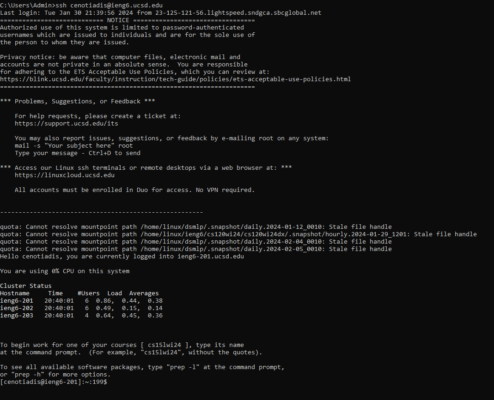

Step 4:

Key presses:

ssh ```<space>``` cenotiadis@ieng6.ucsd.edu

Simply logging into ieng6 (no passcode required) 


Step 5:

Key presses:

git ```<space>``` clone ```<space> <right click>```

(cloning my fork of the lab 7 github repository (right click = paste, link was copied to clipboard)

