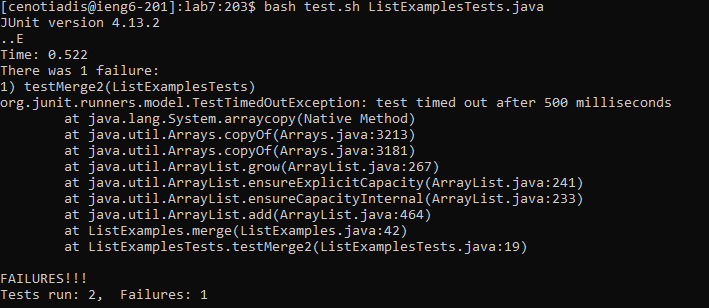

Step 4:

Key presses:

ssh ```<space>``` cenotiadis@ieng6.ucsd.edu

Simply logging into ieng6 (no passcode required) 


Step 5:

Key presses:

git ```<space>``` clone ```<space> <right click>```

(cloning my fork of the lab 7 github repository (right click = paste, link was copied to clipboard)


Step 6:

Key presses:

bash ```<space>``` test.sh ```<space>``` ListExamplesT ```<tab>``` java

Running the tester bash file with the ListExamplesTest.java file to show that the tests are indeed failing.



Step 7:

Key presses:


vim ```<space>``` Li ```<tab> <space>``` .java

s ```<left click> <left arrow><left arrow><left arrow><left arrow><left arrow><left arrow><backspace>``` 2 ```<left click> <left arrow> <left arrow> <left arrow> <backspace> <backspace> <backspace> <escape> <colon< ``` w q

First, use vim to open the editor for the ListExamples file. 

Then, press s to be able to edit the file, click on the line to edit (index1 += 1;), use left arrow to go to where it says 1, backspace and change it to two, then click on the line (result.add(0, s);), left arrow behind the s, backspace 3 times.


